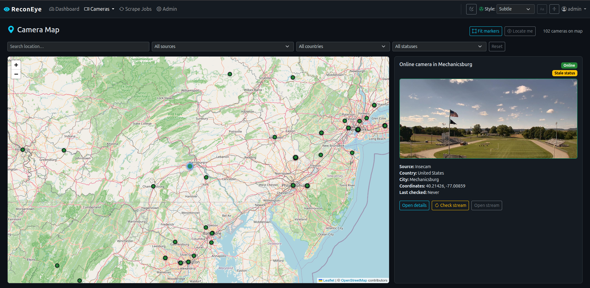

# ReconEye

Django application for IP camera discovery and monitoring.

<p align="center">
   
</p>

## Tech Stack

- **Backend**: Django 5+, Python 3.12+
- **Frontend**: HTMX + Bootstrap 5 (server-rendered)
- **Database**: PostgreSQL with Redis caching
- **Background Jobs**: Celery + Redis broker
- **Scraping**: httpx + asyncio + aiolimiter
- **Deployment**: Docker Compose, gunicorn, whitenoise

## Quick Start

### Local Development

1. **Clone & setup**:
   ```bash
   git clone <repo>
   cd reconeye
   cp .env.example .env
   ```

2. **Install with `uv`**:
   ```bash
   uv sync --all-extras
   ```

3. **Start services** (Docker):
   ```bash
   make docker-up
   ```

4. **Initialize database**:
   ```bash
   make migrate
   make createsuperuser
   ```

5. **Access**:
   - Web: http://localhost:8000  
   - Admin: http://localhost:8000/admin  
   - (Default creds from `createsuperuser`)

### Commands

```bash
make help          # All available tasks
make dev           # Dev server (port 8000)
make migrate       # Apply migrations
make shell         # Django shell
make test          # Run pytest
make lint          # Check code with ruff
make format        # Black + ruff autofix
make typecheck     # mypy type checking
make celery-worker # Celery worker
make celery-beat   # Celery beat scheduler
make docker-up     # Full stack (Docker)
```

## Architecture

```
config/                 # Django config + Celery  
apps/
  cameras/             # Camera models, services, views
  scraping/            # Scrapers (Insecam, WhatsUpCams), tasks
  dashboard/           # Dashboard stats/views
  users/               # Auth (login/logout)
  common/              # Cache, middleware, health endpoints
templates/             # Server-rendered HTML + HTMX partials
static/                # CSS, JS, images
requirements/          # base.txt, dev.txt, prod.txt
docker/                # Dockerfile, nginx.conf, entrypoint.sh
```

## Core Features

### Cameras
- Scraped from **Insecam.org** and **WhatsUpCams** (reference: `wuc` branch)
- Status tracking (online/offline) via periodic health checks
- Partial metadata handling (stream URL may be unavailable; page URL stored)
- Indexed by country, city, source type for fast filtering

### Scraping
- **Async/await** with httpx + aiolimiter (rate-limiting)
- **Celery** background tasks (no blocking in request thread)
- **Progress tracking**: live UI updates via HTMX polling
- **Deduplication** by `source_type` + `page_url`
- **Retry logic** with tenacity

### Dashboard
- Real-time stats (online count, by-country breakdown, active jobs)
- Active scrape job monitoring with progress bars
- Auto-refresh via HTMX polling (30s stats, 10s jobs)

### Cache
- **Redis backend** with versioned key schema: `reconeye:v1:<domain>:<scope>`
- TTLs: 120s (cameras/filters) → 60s (dashboard) → 30s (jobs)
- Signal-based invalidation on model changes
- Admin actions for manual cache invalidation

### Login & Security
- Django session auth + CSRF  
- Entire app login-required except health/readiness endpoints
- Admin panel staff-only
- Secure headers, XSS protection, input validation

## Key Conventions

### Models
- **`Camera.source_payload`**: JSONField (never null) storing raw scrape data for debugging
- **`Camera.has_partial_metadata`**: Boolean flag set when direct stream URL unavailable
- **`ScrapeJob.progress_pct`**: `min(100, round((total_processed / max(total_found, 1)) * 100))`

### Scraping
- Parsers live in `apps/scraping/parsers/{insecam,whatsupcams}.py`
- Tasks: `reconeye.<app>.<task_name>` (Celery naming convention)
- HTTP client: shared factory in `apps/scraping/http.py`
- Services never import tasks; tasks call services

### Views & Templates
- Class-based views with `LoginRequiredMixin`
- HTMX endpoints return partials from `templates/htmx/<domain>/_*.html`
- URL namespaces: `cameras:htmx_list`, `scraping:htmx_jobs`, `dashboard:htmx_stats`

### Admin
- Actions: `invalidate_cameras_cache`, `invalidate_dashboard_cache`, `invalidate_scrape_jobs_cache`, `invalidate_all_cache`
- Trigger scrape tasks directly from admin

## Development Workflow

1. **Code quality** before commit:
   ```bash
   make lint && make format && make typecheck
   ```

2. **Run tests**:
   ```bash
   make test  # or pytest-watch
   ```

3. **Database schema changes**:
   ```bash
   make makemigrations && make migrate
   ```

4. **Start workers** for testing tasks:
   ```bash
   # Terminal 1
   make celery-worker
   # Terminal 2
   make celery-beat
   ```

## Production Deployment

1. Set `DJANGO_SETTINGS_MODULE=config.settings.prod`
2. Generate a strong `SECRET_KEY`
3. Set `ALLOWED_HOSTS`, database URL, Redis URL
4. Use Docker Compose or your orchestrator:
   ```bash
   docker-compose -f docker-compose.yml up -d
   ```
5. Migrations run automatically via entrypoint

## Monitoring & Logging

- **Structured logging** to stdout (container-friendly)
- **Health endpoint**: `GET /health/` (always accessible, requires no auth)
- **Readiness check**: `GET /readiness/` (checks DB connection)
- **Celery logs** include scrape timing, errors, task retries

## Testing

```bash
make test          # Run all tests with coverage
make test-cov      # Open HTML coverage report
```

Tests use `pytest`, `pytest-django`, `factory-boy`.

## Documentation

For project conventions and architecture decisions, see [.github/copilot-instructions.md](.github/copilot-instructions.md).

## License

This project is licensed under the GNU General Public License v3.0 (GPL-3.0).
See [LICENSE](LICENSE) for details.
